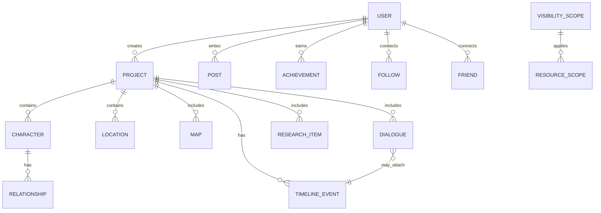

# StoryForge - Gamified Writing Platform

## Table of Contents
1. [Technical Stack](#technical-stack)
2. [Technology Comparison](#technology-comparison)
3. [System Architecture](#system-architecture)
4. [Frontend Design & Architecture](#frontend-design-and-architecture)
5. [Database Design](#database-design)
6. [API Design](#api-design)
7. [Access Scopes & Privacy Model](#access-scopes--privacy-model)
8. [Gamification & Social](#gamification--social)
9. [Notifications & Messaging](#notifications--messaging)
10. [Security Considerations](#security-considerations)
11. [Design System & Color Palette](#design-system--color-palette)
12. [Deployment Strategy](#deployment-strategy)
13. [Development Roadmap](#development-roadmap)
14. [Monetization Strategy](#monetization-strategy)
15. [Future Considerations](#future-considerations)

## Technical Stack

### Primary Stack

- **Frontend:** Next.js 16 (App Router) + React 19.2 + TypeScript
- **Backend:** NestJS 11.1 (Node.js + TypeScript)
- **Database:** PostgreSQL with Prisma ORM (Prisma 7.2)
- **Infrastructure:** Vercel + Railway + Supabase

### Why This Stack?
- **Full-Stack Type Safety:** Shared types between frontend and backend
- **Developer Experience:** Modern tooling and great TypeScript support
- **Scalability:** Easy to scale from MVP to production
- **Ecosystem:** Rich set of libraries and tools
- **Cost-Effective:** Generous free tiers available

## Technology Comparison

### Backend Options

#### 1. TypeScript/Node.js (NestJS)
**Pros:**
- Full-stack TypeScript
- Great for I/O-heavy apps
- Rich npm ecosystem
- Excellent real-time support
- Lower learning curve if team knows JS/TS

**Cons:**
- Single-threaded nature
- Less performant for CPU-heavy tasks

#### 2. Go
**Pros:**
- Excellent performance
- Built-in concurrency
- Low memory footprint
- Single binary deployment

**Cons:**
- Steeper learning curve
- More verbose than TypeScript
- Younger ecosystem

#### 3. Java (Spring Boot)
**Pros:**
- Enterprise-grade
- Excellent performance
- Strong typing
- Large talent pool

**Cons:**
- More verbose
- Slower development cycle
- Higher memory usage

#### 4. Python (FastAPI)
**Pros:**
- Rapid development
- Best for AI/ML
- Great for data processing

**Cons:**
- Slower performance
- GIL limitations
- Type system not as strong as TS/Java

### Recommendation
We recommend **TypeScript with NestJS** for:
1. Full-stack consistency
2. Excellent real-time support
3. Faster development cycles
4. Strong type safety
5. Large ecosystem

## Technical Stack

### Frontend

- **Next.js 16 (App Router)**
  - Server-side rendering, API routes, and optimized performance
  - Alternatives: Remix, SvelteKit
  - Key Features:
    - App Router for better routing and data fetching
    - Server Components for better performance
    - Built-in API routes
    - Image optimization

- **React 19.2**
  - Mature ecosystem, great performance, and wide adoption
  - **State Management:**
    - TanStack Query (v5) for server state
      - Excellent for server state management, caching, and background updates
      - Alternatives: SWR, Apollo Client
    - Zustand for client state
      - Lightweight client state management
      - Alternatives: Jotai, Recoil

- **UI Components & Styling**
  - shadcn/ui for accessible components
    - Accessible, customizable, and built on top of Radix UI
    - Alternatives: Chakra UI, Material-UI
  - Tailwind CSS 4.1 for utility-first styling
    - Utility-first CSS framework for rapid UI development
    - Alternatives: Styled Components, Emotion
  - Data Visualization
    - Three.js 
          - For 3D relationship graphs and interactive maps
          - Alternatives: D3.js (for 2D), react-three-fiber
    - React Flow 
        - For interactive node-based relationship mapping
        - Alternatives: Vis.js, Cytoscape.js
    - D3.js for interactive charts
      - Alternatives: Chart.js, Recharts
  - Framer Motion for animations
  - React Hook Form for form handling
    - Performance-optimized forms with minimal re-renders
    - Alternatives: Formik, Final Form

- **Rich Text Editing**
  - TipTap (ProseMirror-based)
  - Custom extensions for writing-specific features
  - Real-time collaboration support

- **Data Visualization**
  - D3.js for interactive charts
  - React Flow for relationship mapping
  - Three.js for 3D world visualization

### Backend
- **NestJS**
  - TypeScript support
  - Modular architecture
  - Built-in dependency injection
  - Excellent documentation

- **Authentication**
  - NextAuth.js
  - JWT + Refresh Tokens
  - OAuth2 providers (Google, GitHub, etc.)
  - Rate limiting and brute force protection

- **Database**
  - PostgreSQL with Prisma ORM
  - Redis for caching and real-time features
  - MeiliSearch for full-text search

- **Real-time Features**
  - WebSockets (Socket.IO)
  - Presence indicators
  - Live collaboration
  - Real-time notifications

### Optional/Adjacents (alternatives)
- **tRPC** for end-to-end types instead of REST, if the team prefers RPC semantics.
- **Drizzle ORM** as an alternative to Prisma for SQL-first migrations.
- **Supabase** as a BaaS alternative for Auth, Postgres, Realtime, Storage.

## System Architecture

### Frontend Architecture
```
src/
├── app/                    # App router pages
│   ├── (auth)/             # Authentication routes
│   ├── (main)/             # Authenticated routes
│   │   ├── dashboard/      # User dashboard
│   │   ├── projects/       # Project management
│   │   └── social/         # Social features
│   ├── (marketing)/        # Public pages
│   └── api/                # API routes
├── components/             # Reusable components
│   ├── ui/                 # Shadcn/ui components
│   ├── editor/             # Rich text editor
│   ├── world-building/     # World building tools
│   └── social/             # Social features
├── lib/                    # Utilities and configs
├── hooks/                  # Custom React hooks
├── stores/                 # Zustand stores
├── types/                  # TypeScript types
└── styles/                 # Global styles
```

### Backend Architecture
```
src/
├── modules/
│   ├── auth/               # Authentication
│   ├── users/              # User management
│   ├── projects/           # Writing projects
│   ├── world-building/     # World building
│   ├── social/             # Social features
│   └── gamification/       # Gamification system
├── common/                 # Shared modules
│   ├── decorators/         # Custom decorators
│   ├── filters/           # Exception filters
│   ├── guards/            # Auth guards
│   └── interceptors/      # Response interceptors
└── config/                # Configuration
```

### Public vs. Authenticated Areas
- Public marketing pages (home, docs/tutorials, pricing) and public reading feed are accessible without sign-in.
- Authenticated app area (dashboard, projects, writing tools, groups, chats) uses session-based auth with SSR protection and CSRF mitigation.
- Feature flags gate premium/subscription features without leaking UI affordances to non-eligible users.

### Feature Flags

Feature flags are used to progressively roll out features and gate premium functionality.

- Shared keys across web and API: `payments`, `aiAssist`, `projectsV2`, `wellbeing`, `designSystemV2`.
- Web (client-visible): provided via `NEXT_PUBLIC_FEATURE_*` env vars and read in `web/src/lib/flags.ts` (`flags`,
  `isEnabled`).
- API (server-only): provided via `API_FEATURE_*` env vars and read in `api/src/config/flags.ts` (`apiFlags`,
  `isApiFlagEnabled`).

Operational guidance

- Keep sensitive toggles server-side only.
- Mirror flag names between web and API for consistent behavior.
- Default wellbeing and design-system tokens to enabled; others default disabled.

## Frontend Design & Architecture

### UI Framework Comparison

#### 1. Next.js (Recommended)
**Why?** Best for content-focused applications with SSR/SSG
- **Pros:**
    - Built-in routing and API routes
    - Excellent SEO capabilities
    - Automatic code splitting
    - Image optimization
    - Great TypeScript support
    - App Router for better data fetching
- **Cons:**
    - Steeper learning curve than traditional SPAs
    - Larger bundle size than SvelteKit
- **Best For:** Content-heavy applications needing SEO and performance

#### 2. SvelteKit
**Alternative for simpler applications**
- **Pros:**
    - Excellent performance
    - Smaller bundle sizes
    - Easier learning curve
    - Built-in animations
- **Cons:**
    - Smaller ecosystem
    - Fewer enterprise features
- **Best For:** Interactive applications where bundle size is critical

### State Management

#### 1. React Query (TanStack Query)
**Recommended for server state**
- **Pros:**
    - Automatic caching
    - Background updates
    - Pagination support
    - Optimistic updates
- **Cons:**
    - Learning curve
    - Overkill for simple apps

#### 2. Zustand
**Recommended for client state**
- **Pros:**
    - Simple API
    - No provider needed
    - Small bundle size
    - Middleware support
- **Cons:**
    - Less structure than Redux
    - Can become unwieldy in large apps

### Styling Solutions

#### 1. Tailwind CSS (Recommended)
- **Pros:**
    - Utility-first approach
    - Highly customizable
    - Small production bundle
    - Great developer experience
- **Cons:**
    - Learning curve
    - Can make JSX verbose

#### 2. Styled Components
- **Pros:**
    - CSS-in-JS
    - Scoped styles
    - Theming support
- **Cons:**
    - Larger bundle size
    - Runtime overhead

### Component Libraries

#### 1. shadcn/ui (Recommended)
- **Pros:**
    - Accessible components
    - Customizable
    - Built on Radix UI
    - Copy-paste components
- **Cons:**
    - Newer library
    - Smaller community

#### 2. Material-UI
- **Pros:**
    - Comprehensive
    - Theming support
    - Large community
- **Cons:**
    - Larger bundle size
    - Customization can be complex

### Data Visualization

#### 1. D3.js
- **Pros:**
    - Most powerful
    - Highly customizable
    - Large ecosystem
- **Cons:**
    - Steep learning curve
    - Verbose API

#### 2. Recharts
- **Pros:**
    - React components
    - Simpler API
    - Good documentation
- **Cons:**
    - Less flexible than D3
    - Fewer chart types

### Form Handling

#### 1. React Hook Form (Recommended)
- **Pros:**
    - Performance optimized
    - Small bundle size
    - Great TypeScript support
- **Cons:**
    - Learning curve
    - Less opinionated

#### 2. Formik
- **Pros:**
    - Popular
    - Good documentation
    - Form state management
- **Cons:**
    - Larger bundle size
    - More boilerplate

### Testing Strategy

#### 1. Unit Testing
- **Jest + React Testing Library**
    - Component testing
    - Snapshot testing
    - Mocking

#### 2. E2E Testing
- **Cypress**
    - Component testing
    - Visual regression
    - API testing

### Performance Optimization

1. **Code Splitting**
    - Route-based
    - Component-based

2. **Lazy Loading**
    - Images
    - Components
    - Libraries

3. **Bundle Analysis**
    - Webpack Bundle Analyzer
    - Source map explorer

### Accessibility (a11y)

1. **Keyboard Navigation**
    - Focus management
    - Keyboard shortcuts

2. **Screen Reader Support**
    - ARIA attributes
    - Semantic HTML

3. **Color Contrast**
    - WCAG compliance
    - Dark mode support

### Recommended Tech Stack

1. **Core**
    - Next.js 16 (App Router)
    - TypeScript 5.9+
    - React 19.2

2. **State Management**
    - TanStack Query (server state)
    - Zustand (client state)

3. **Styling**
    - Tailwind CSS
    - shadcn/ui components

4. **Testing**
    - Jest + React Testing Library
    - Cypress

5. **Tooling**
    - ESLint + Prettier
    - Husky + lint-staged
    - Storybook

6. **Realtime/Graph**
    - Socket.IO client (presence, collab, notifications)
    - react-three-fiber + three.js for 3D character relationship maps
    - React Flow for 2D graphs

## Database Design

### Core Entities


### Key Tables
1. **Users**
   - id, email, username, hashed_password
   - profile_image, bio, website
   - settings (JSONB for preferences)
   - subscription_status, subscription_expires_at
   - preferences (notification settings, etc.)

2. **Projects**
   - id, user_id, title, description
   - genre, is_public, word_count
   - last_updated, created_at
   - settings (JSONB for custom fields)
   - default_scope (enum: private, friends, public_auth, public_anyone)

3. **Characters**
   - id, project_id, name, bio
   - appearance, personality (JSONB)
   - relationships (JSONB for dynamic fields)
   - images (array of URLs)
   - tags (array)

4. **WorldBuilding**
   - locations, maps, items, etc.
   - Each with appropriate relationships
   - Support for custom fields

5. **Timelines / Events**
   - id, project_id, title, description, start_at, end_at, characters_involved (array)
   - links to dialogues and locations

6. **Dialogues**
   - id, project_id, title, participants (array of character_ids)
   - content (structured; TipTap JSON)
   - optional timeline_event_id

7. **Scopes & ACL**
   - VISIBILITY_SCOPE (id, name, rules JSON)
   - RESOURCE_SCOPE (resource_type, resource_id, scope_id, overrides JSON)

8. **Social**
   - FOLLOW (follower_id, followee_id)
   - FRIEND (user_id, friend_user_id, status)
   - GROUP (id, name, owner_id, visibility)
   - GROUP_MEMBER (group_id, user_id, role)

9. **Gamification**
   - GOAL (user_id, type, target, cadence)
   - PROGRESS_LOG (user_id, goal_id, value, timestamp)
   - GEM_WALLET (user_id, balance)
   - GEM_TX (user_id, amount, reason, metadata)

10. **Notifications**
   - NOTIFICATION (user_id, type, payload JSON, read_at)
   - DELIVERY_PREF (user_id, email, sms, push, cadence, quiet_hours)

## API Design (REST + WebSockets)

### REST Endpoints
- `GET /api/projects` - List user's projects
- `POST /api/projects` - Create new project
- `GET /api/projects/:id` - Get project details
- `PATCH /api/projects/:id` - Update project
- `GET /api/projects/:id/characters` - Get project characters
- `POST /api/projects/:id/export` - Export project

### WebSocket Events
- `project:updated` - Project content changes
- `collaboration:update` - Real-time collaboration
- `notification:new` - New notifications
- `presence:update` - User presence updates

### GraphQL (Optional)
If collaboration with mobile or external partners grows, expose a GraphQL gateway (NestJS GraphQL) for read-heavy queries like story feeds and search, while retaining REST for mutations requiring strict idempotency and rate limiting.

## Access Scopes & Privacy Model

Every shareable resource supports a default scope plus per-item overrides.

- Scopes: `private`, `friends`, `public-authenticated`, `public-anyone`.
- Overrides cascade: item override > project default > user default.
- Share Links: time-bound signed URLs for view-only sharing.
- Moderation: report/flag with automated quarantine; privacy-respecting indexing rules.

Implementation
- Table `RESOURCE_SCOPE` stores overrides per resource.
- Guard composables in NestJS check scope against requester context.
- Feed queries include scope filters to ensure only eligible content is returned.

## Gamification & Social

Core mechanics
- Streaks, daily/weekly goals (minutes written, words, elements created).
- Gems awarded on goals and community contributions. Gems redeemable for themes, profile cosmetics, gift to friends.
- Leaderboards with anti-cheat heuristics (e.g., min active time per word thresholds).

Social
- Follow users, friend requests (bi-directional), groups and events, comment threads, reactions.
- Public reading feed for guests and authenticated users; personalized feed for logged-in.

Mental Health & Wellbeing
- Opt-in focus mode, scheduled breaks, quiet hours for notifications.
- Burnout detectors (sustained high-intensity sessions) nudging rest.
- Private journaling and mood check-ins; data stored privately and excluded from social surfaces by default.

Anti-abuse
- Rate limits on posting and messaging, content filters, block/mute lists.

## Notifications & Messaging

Channels
- In-app real-time toasts (Socket.IO), email (Resend/SES), SMS (Twilio), and optional push (Web Push/Firebase).

Delivery Controls
- User-set cadence (immediate, digest daily/weekly) and quiet hours; per-event type toggles.

Messaging
- 1:1 DMs and multi-user rooms with message retention policies.
- Threaded comments on posts/projects.

## Security Considerations

## Security Considerations

### Authentication & Authorization
- JWT with short expiration (15m)
- Refresh tokens with rotation
- Role-based access control (RBAC)
- Rate limiting on auth endpoints
- CSRF protection
  - For web-only forms; NextAuth session protection

#### NextAuth v4 Implementation (Web)

- Shared options at `web/src/lib/auth.ts` using Prisma Adapter and Credentials provider.
- API route `web/src/app/api/auth/[...nextauth]/route.ts` creates a handler with `NextAuth(authOptions)` and exports it
  as `{ GET, POST }`.
- Sessions use JWT strategy and we augment `session.user.id` for convenience in the UI via callbacks.
- Environment for web must include `NEXTAUTH_SECRET`, `NEXTAUTH_URL`, and `DATABASE_URL`.
- Server usage:
  `import { getServerSession } from 'next-auth'; import { authOptions } from '@/lib/auth'; const session = await getServerSession(authOptions);`
- Client sign-in: `import { signIn } from 'next-auth/react'; await signIn('credentials', { email, password })`.
- Client sign-up: `POST /api/auth/signup` accepts `{ email, password (min 8), name? }`, validated by Zod and hashed with
  bcrypt; example UI at `/signup` that auto signs in on success.
- Protected routes: App Router `(main)` segment uses `app/(main)/layout.tsx` to call `getServerSession(authOptions)` and
  `redirect('/signin')` if unauthenticated; example page `app/(main)/dashboard/page.tsx` with a sign-out button.

### Data Protection
- Field-level encryption for sensitive data
- Input validation and sanitization
- Prepared statements
- CORS configuration
- Rate limiting

### Monitoring & Logging
- Request logging
- Security event logging
- Suspicious activity detection
- Audit trails for sensitive operations

Compliance & Privacy
- GDPR/CCPA-ready data export and deletion.
- Data minimization: optional PII, encrypted at rest using managed KMS.
- Secrets via environment managers (Doppler/GitHub Encrypted Secrets).

## Deployment Strategy

### Recommended Setup

#### MVP/Pre-Seed (0-1k users)
- **Frontend:** Vercel (Hobby)
- **Backend:** Railway (Starter)
- **Database:** Supabase/Neon
- **Realtime:** Supabase Realtime
- **CI/CD:** GitHub Actions
- **Cost:** ~$0-20/month

Optional alternative single-cloud: Fly.io (frontend + backend + Postgres) for lower latency multi-region and predictable pricing.

#### Growth (1k-100k users)
- **Frontend:** Vercel (Pro)
- **Backend:** AWS ECS Fargate
- **Database:** AWS RDS/Aurora
- **Caching:** ElastiCache (Redis)
- **Search:** MeiliSearch
- **CI/CD:** GitHub Actions + ArgoCD
- **Cost:** ~$100-300/month

#### Scale (100k+ users)
- **Frontend:** Vercel + Edge Network
- **Backend:** AWS EKS (Kubernetes)
- **Database:** Sharded PostgreSQL/CockroachDB
- **Search:** OpenSearch
- **Caching:** Multi-region Redis
- **CI/CD:** GitOps with ArgoCD
- **Cost:** $1000+/month

### Development Environment
- **Local:** Docker Compose
- **Version Control:** GitHub
- **Code Quality:** ESLint, Prettier, Husky
- **Testing:** Jest, Cypress, React Testing Library

### Staging Environment
- Preview deployments for each PR
- Automated E2E tests
- Performance testing
- Security scanning
- Feature flags

### Production Environment
- **Frontend:**
  - Vercel (Global CDN)
  - Image optimization
  - Performance monitoring
  
- **Backend:**
  - Container orchestration (Kubernetes)
  - Auto-scaling
  - Load balancing
  - Service mesh (Istio/Linkerd)
  
- **Database:**
  - Primary + read replicas
  - Regular backups
  - Point-in-time recovery
  - Performance monitoring

### Monitoring & Observability
- **Error Tracking:** Sentry
- **APM:** New Relic/Datadog
- **Logging:** ELK Stack
- **Metrics:** Prometheus + Grafana
- **Uptime:** StatusCake

### Disaster Recovery
- Multi-region deployment
- Automated backups
- Rollback procedures
- Incident response plan

## Development Roadmap

### Phase 1: MVP (6-8 weeks)
- Public marketing site and docs/tutorials
- Anonymous browsing of public stories feed
- Auth (email/password + OAuth), profiles
- Projects, characters, basic relationships
- TipTap-based manuscript, autosave, version history (local)
- Initial scopes (project default + item override)
- Gamification: goals, streak counter, gem wallet prototype
- Theming with light/dark and royal palette

### Phase 2: Core Features (6-10 weeks)
- Worldbuilding modules (Locations, Maps, Research, Timeline, Calendar, Relationships, Encyclopedia, Magic, Fauna, Flora, Cultures, Items, Systems, Languages, Religions, Philosophies)
- Relationship map (React Flow) + optional 3D view (r3f/three)
- Timeline editor with event linking to dialogues and characters
- Export (PDF/EPUB), Share links, Search

### Phase 3: Social & Collaboration (6-8 weeks)
- Followers/friends, groups, events
- Comments, reactions, moderation
- Realtime presence and collaborative editing
- DMs and rooms

### Phase 4: Advanced Features (Ongoing)
- AI-assisted writing tools
- Mobile app (React Native/Expo)
- Advanced analytics and wellbeing insights
- Plugin API and marketplace

## Monetization Strategy

### Freemium Model
- **Free Tier**
  - 3 active projects
  - Basic world-building tools
  - Community features
  - Basic export options

- **Premium Tier ($9.99/month)**
  - Unlimited projects
  - Advanced world-building tools
  - PDF/EPUB export
  - Priority support
  - Advanced analytics
  - 3D maps and relationship graphs
  - Advanced notification channels and digests

- **Team Tier ($24.99/month)**
  - Everything in Premium
  - Team collaboration
  - Advanced permissions
  - Shared resources
  - Team analytics

## Future Considerations

### Technical Debt Management
- Regular code reviews
- Comprehensive test coverage
- Documentation standards
- Performance monitoring
- Regular dependency updates

### Scaling
- Database sharding
- Microservices architecture
- Edge computing
- CDN optimization
- Caching strategies

### Community Building
- Writing challenges
- Featured authors
- Integration with writing communities
- User feedback program
- Beta testing program

### AI Integration
- Writing suggestions
- Character development
- Plot analysis
- Style consistency
- Research assistance

### Mobile Experience
- Progressive Web App (PWA)
- Native mobile apps
- Offline functionality
- Mobile-optimized UI

### Analytics & Insights
- Writing habits
- Productivity metrics
- Reader engagement
- Content analysis
- Goal tracking

## Design System & Color Palette

Color palette inspired by classic literature and guild aesthetics, optimized for light/dark themes and WCAG AA contrast.

Palette names
- Auburn, Royal Blue, Royal Green, Royal Orange, Gold, Burgundy, Purple, Pink, Black, White

See `docs/design-tokens.json` for exact values and semantic mappings. Tokens are exposed as CSS variables in
`web/src/styles/globals.css` (e.g., `--bg`, `--fg`, `--brand`, typography sizes, spacing, and elevation shadows) and
mapped to utility-like classes (e.g., `bg-bg`, `text-fg`, `text-sm`, `shadow-elev-1`) for use without a custom Tailwind
config. Dark mode toggles these variables via the `.dark` class; a persisted `DarkModeToggle` component is provided at
`web/src/components/dark-mode-toggle.tsx` and respects `prefers-color-scheme`.

Example (light mode):

```
--fg: #0b0b0f;
--bg: #ffffff;
--brand: #0e3fa9; /* Royal Blue */
--accent: #b4371e; /* Auburn */
--success: #16794e; /* Royal Green */
--warning: #d97706; /* Royal Orange */
--info: #6d28d9; /* Purple */
--muted: #6b7280;
--ring: #d4af37; /* Gold */
```

Component tokens
- Buttons: primary uses `brand`, secondary uses `accent`, outline uses `ring`.
- Editor: page background off-white in light, deep graphite in dark; high-contrast ink color.
- Relationship graphs: node colors mapped to entity types, link labels editable, colorblind-friendly variants.

Public information architecture (unauthenticated)

- `/` marketing home and overview
- `/pricing` pricing & subscriptions explainer (checkout gated behind `payments` flag)
- `/feed` public stories feed (SSR placeholder for `public-anyone`)
- `/about` about StoryForge; `/faq` common questions
- `/components-demo`, `/components-demo/tokens`, `/components-demo/ui` for internal demos

Developer aids

- Web debug flags endpoint (dev only): `GET /api/debug/flags` → `{ env, flags }` (hidden in production).

Typography
- System font stack with optional variable font (e.g., Inter/Recursive), generous line-height for long-form reading.

Iconography
- Lucide/Radix icons; solid outline variants for state toggles.

Illustrations
- Low-noise geometric motifs, subtle gold accents.

This documentation provides a comprehensive overview of the StoryForge platform. The architecture is designed to be scalable, maintainable, and provide an excellent user experience for writers of all levels.
